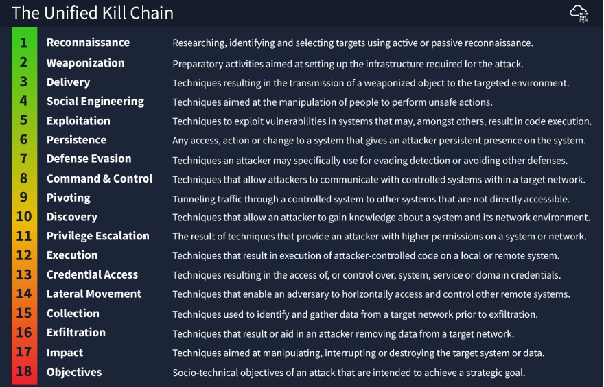

# unified-kill-chain
The Unified Kill Chain is a framework which establishes the phases of an attack, and a means of identifying and mitigating risk to IT assets.
# Unified Kill Chain

## 🧩 What is the Unified Kill Chain?

The **Unified Kill Chain** is an advanced **cyberattack model** that combines two major frameworks:

- **Cyber Kill Chain** (by Lockheed Martin)
- **MITRE ATT&CK Framework**

Its goal is to **describe the full lifecycle of a cyberattack**, from the initial breach to the final objectives (like exfiltration or destruction), highlighting the **tactics and techniques** used at each stage.

---

## 🧠 Model Structure

The Unified Kill Chain is divided into **3 main phases**, consisting of **18 distinct steps**:

### 📌 Phase 1: Initial Foothold

1. **Reconnaissance**  
2. **Weaponization**  
3. **Delivery**  
4. **Social Engineering**  
5. **Exploitation**  
6. **Installation**  

### 📌 Phase 2: Network Propagation

7. **Command and Control (C2)**  
8. **Internal Reconnaissance**  
9. **Credential Access**  
10. **Privilege Escalation**  
11. **Lateral Movement**  
12. **Persistence**  

### 📌 Phase 3: Action on Objectives

13. **Collection**  
14. **Exfiltration**  
15. **Impact (e.g., ransomware, data corruption)**  
16. **Obfuscation**  
17. **Anti-Forensics**  
18. **Covering Tracks**  

---

## 🎯 Purpose of the Model

The Unified Kill Chain helps to:

- **Understand attacker tactics and sequences**
- **Detect and disrupt** attacks at any stage
- **Strengthen defenses** across all phases of an incident

---

## 🛡️ Usage in Cyber Defense

- Map **SOC alerts** to specific kill chain stages
- Identify **security gaps** within your environment
- Train **blue teams and red teams** more effectively

---

## 📚 Useful Resources

- [MITRE ATT&CK Framework](https://attack.mitre.org/)  
- [Lockheed Martin Cyber Kill Chain](https://www.lockheedmartin.com/en-us/capabilities/cyber/cyber-kill-chain.html)  
- [Unified Kill Chain (by Paul Pols)](https://www.unifiedkillchain.com/)  

---

> 🛡️ _“Know your enemy and you’ve already won half the battle.” — The Unified Kill Chain is an essential tool for understanding and defending against modern cyberattacks._
